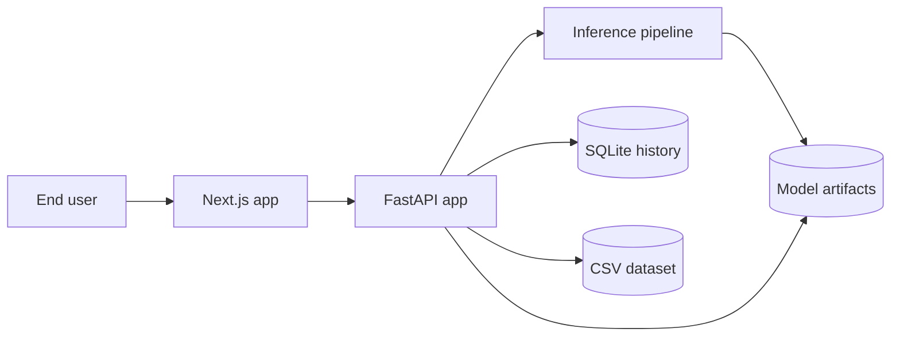
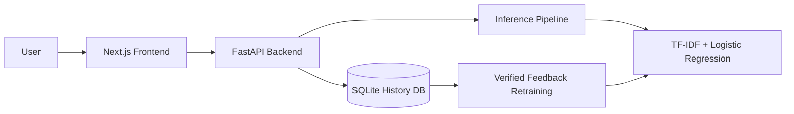

# Fake News Detector

Fake News Detector is a full-stack web application that analyzes news content and predicts whether an article is more likely to be `FAKE` or `REAL`. The project combines a modern Next.js frontend with a FastAPI backend, a classical machine learning pipeline based on TF-IDF plus Logistic Regression, SQLite-backed history storage, and a verified-label retraining workflow.

The system supports two main input modes: users can either paste article text directly into the web interface or submit a public article URL for backend scraping and analysis. After a prediction is made, the application returns the predicted label, confidence score, class probabilities, and influential keywords that help explain why the model leaned toward fake or real news. Each analysis is stored in the history database so the dashboard can show recent activity, usage patterns, and retraining readiness.

The repository currently focuses on the web application. The codebase is organized around:

- `frontend/` for the web UI
- `backend/` for the API, ML pipeline, SQLite history, and retraining logic
- `docs/` for architecture, flowcharts, and pipeline explanations

## Current Project Status

- The web UI supports text prediction, URL prediction, dashboard metrics, history browsing, manual retraining, and plain-text report download
- The backend and Next.js route handlers support history verification, but the current main page does not yet expose a verify button
- The backend can run even if no trained model artifact is present by falling back to a heuristic demo mode
- The repository currently includes the base dataset CSVs in `backend/data/`
- Generated model artifacts are written to `backend/models/` during training and are typically treated as local outputs

## Features

- Predict from pasted article text
- Predict from article URLs using backend scraping
- Return `FAKE` or `REAL` with confidence and class probabilities
- Surface influential keywords for explainability
- Store prediction history in SQLite
- Expose verification endpoints for collecting ground-truth labels
- Retrain the model from verified labels while keeping a fixed validation holdout
- Auto-check retraining readiness every 50 successful predictions by default
- Fall back to demo heuristics when no fitted model is available

## Tech Stack

- Frontend: Next.js 16, React 19, TypeScript, Tailwind CSS, shadcn/ui, Recharts, Framer Motion
- Backend: FastAPI, Pydantic, SQLite
- ML/NLP: scikit-learn, pandas, NLTK, BeautifulSoup, requests
- Tooling: PowerShell helper scripts, pytest, ESLint, TypeScript, GitHub Actions

## Architecture

### System Overview



### Detailed Data Flow



See [docs/architecture.md](docs/architecture.md) for the code-level architecture and [docs/pipeline.md](docs/pipeline.md) for the pipeline map.

## Repository Structure

```text
.
|-- backend/
|   |-- main.py
|   |-- db.py
|   |-- inference.py
|   |-- preprocessing.py
|   |-- model.py
|   |-- train.py
|   |-- data/
|   |-- models/
|   `-- tests/
|-- frontend/
|   |-- src/app/
|   |-- src/components/
|   |-- src/lib/
|   `-- app/api/
|-- docs/
|   |-- README.md
|   |-- architecture.md
|   |-- pipeline.md
|   |-- api.md
|   |-- development.md
|   `-- diagrams/
|-- scripts/
|-- .github/workflows/ci.yml
`-- LICENSE
```

## Quick Start

### Option 1: Windows setup scripts

Install backend and frontend dependencies, create the backend virtual environment, and copy env files:

```powershell
powershell -ExecutionPolicy Bypass -File .\scripts\setup.ps1
```

Start the backend and frontend in separate PowerShell windows:

```powershell
powershell -ExecutionPolicy Bypass -File .\scripts\dev.ps1
```

Open `http://localhost:3000`.

### Option 2: Manual setup

#### Backend

```powershell
cd backend
python -m venv .venv
.\.venv\Scripts\activate
pip install -r requirements.txt
copy .env.example .env
python main.py
```

#### Frontend

```powershell
cd frontend
npm install
copy .env.local.example .env.local
npm run dev
```

Open `http://localhost:3000`.

## How To Run

Use two separate terminals after setup.

### Terminal 1: Run the backend

```powershell
cd backend
.\.venv\Scripts\activate
python main.py
```

The FastAPI backend starts on `http://127.0.0.1:8000`.

### Terminal 2: Run the frontend

```powershell
cd frontend
npm run dev
```

The Next.js frontend starts on `http://localhost:3000`.

### Open the app

After both servers are running, open:

```text
http://localhost:3000
```

## Environment Configuration

### Frontend

Use [frontend/.env.local.example](frontend/.env.local.example):

```env
BACKEND_URL=http://127.0.0.1:8000
```

`frontend/src/lib/backend.ts` also accepts `NEXT_PUBLIC_BACKEND_URL`, but `BACKEND_URL` is the value used by the example env file and CI build.

### Backend

Use [backend/.env.example](backend/.env.example):

```env
FAKE_NEWS_DB_FILENAME=fake_news_history.db
FAKE_NEWS_AUTO_RETRAIN_CHECK_INTERVAL=50
FAKE_NEWS_CORS_ORIGINS=http://localhost:3000,http://127.0.0.1:3000
```

## API Surface

Main FastAPI routes in `backend/main.py`:

- `GET /`
- `GET /health`
- `POST /predict`
- `POST /predict-url`
- `GET /metrics`
- `GET /history`
- `GET /history/stats`
- `POST /history/{entry_id}/verify`
- `GET /training/stats`
- `POST /retrain`
- `GET /retrain/status`

The repository also includes Next.js route handlers under `frontend/app/api/`, but the current main page mostly calls the FastAPI backend directly through `fetchBackend()`.

## Data, Model Artifacts, and Algorithms

- The training dataset currently lives in `backend/data/Fake.csv` and `backend/data/True.csv`
- The training loader also accepts `fake.csv`, `False.csv`, `false.csv`, and `true.csv`
- Training writes `fake_news_model.joblib`, `model_metrics.json`, and `training_splits.joblib` into `backend/models/`
- If the trained model artifact is missing or invalid, inference falls back to heuristic demo mode so the UI still works

### Current ML configuration

The implemented classifier uses:

- `TfidfVectorizer(max_features=10000, ngram_range=(1, 2), min_df=2, max_df=0.95, sublinear_tf=True, strip_accents="unicode", lowercase=True)`
- `LogisticRegression(C=1.0, solver="lbfgs", class_weight="balanced", max_iter=1000, random_state=42)`

### Current preprocessing behavior

The preprocessing pipeline performs:

- HTML, URL, email, mention, and hashtag cleanup
- lowercasing
- punctuation removal
- tokenization with NLTK when available, otherwise regex fallback
- stopword removal with NLTK or sklearn fallback
- optional lemmatization when WordNet is available

### Retraining behavior

- Verified samples come from SQLite history entries with `verified_label`
- Retraining requires at least `50` verified samples after preprocessing
- Retraining combines verified samples with the saved base training split
- Evaluation runs on the fixed holdout saved in `backend/models/training_splits.joblib`
- Successful retraining replaces the in-memory model and writes updated metrics back to disk

## Quality Checks

### Backend tests

```powershell
cd backend
.\.venv\Scripts\activate
pytest tests --basetemp=.pytest-tmp -o cache_dir=.pytest-tmp/.pytest_cache
```

### Frontend checks

```powershell
cd frontend
npm run lint
npm run typecheck
npm run build
```

### Full local check

```powershell
powershell -ExecutionPolicy Bypass -File .\scripts\check.ps1
```

## Related Docs

See [docs/README.md](docs/README.md) for an overview of all documentation.

Main documentation files:

- [Architecture](docs/architecture.md)
- [Pipeline](docs/pipeline.md)
- [API Reference](docs/api.md)
- [Development Guide](docs/development.md)

## License

This project is licensed under the MIT License. See [LICENSE](LICENSE).
