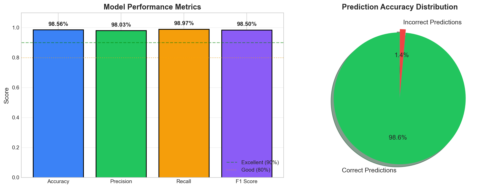
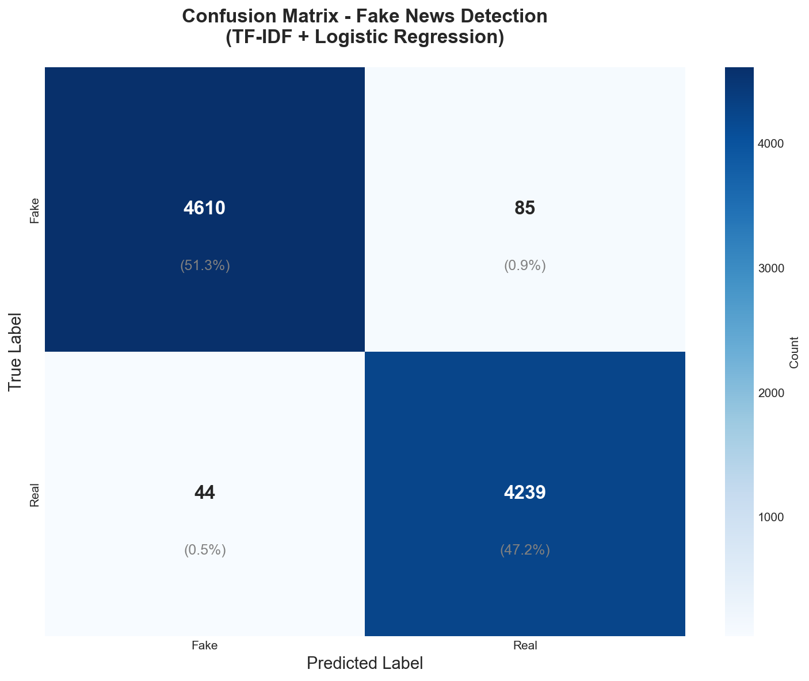
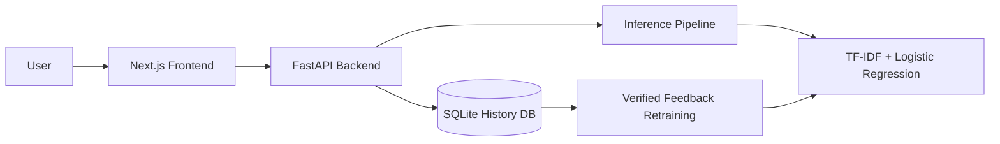

# Fake News Detector

A full-stack machine learning application that classifies news content as likely `REAL` or `FAKE` using a FastAPI backend, a Next.js frontend, and a TF-IDF plus Logistic Regression pipeline.

The project is designed to show more than a single model notebook. It demonstrates product thinking, explainable predictions, persistent history, verified-feedback retraining, and a polished web interface for presenting the system end to end.

## Why This Project Stands Out

- End-to-end product: frontend, backend, model inference, persistence, and retraining workflow
- Explainability: keyword-level feature importance is surfaced in the UI
- Continuous improvement loop: verified predictions can be fed back into retraining
- Interview-ready structure: CI, tests, env examples, scripts, docs, and a license

## Demo Highlights

### Model Metrics



### Confusion Matrix



### Architecture

See [docs/system-architecture.md](docs/system-architecture.md) for the full system walkthrough.



## Features

- Predict from pasted news text
- Predict from article URLs via backend scraping
- Display fake/real probabilities and confidence
- Show keyword importance for explainability
- Store prediction history in SQLite
- Verify historical predictions with ground-truth labels
- Trigger manual retraining from verified samples
- Periodically check whether auto-retraining is recommended
- Visualize model metrics in the frontend

## Tech Stack

- Frontend: Next.js, React, TypeScript, Tailwind CSS, shadcn/ui, Recharts
- Backend: FastAPI, Pydantic, SQLite
- ML/NLP: scikit-learn, pandas, NLTK, BeautifulSoup
- Tooling: GitHub Actions, pytest, ESLint

## Repository Structure

```text
.
|-- backend/
|   |-- main.py
|   |-- inference.py
|   |-- preprocessing.py
|   |-- train.py
|   |-- model.py
|   |-- requirements.txt
|   |-- requirements-dev.txt
|   |-- tests/
|   `-- models/
|-- frontend/
|   |-- src/app/
|   |-- src/components/
|   |-- src/lib/
|   `-- package.json
|-- docs/
|   |-- system-architecture.md
|   `-- complete_project_report.md
|-- scripts/
|   |-- setup.ps1
|   |-- dev.ps1
|   `-- check.ps1
|-- .github/workflows/ci.yml
`-- LICENSE
```

## Quick Start

### Option 1: Windows One-Command Setup

```powershell
powershell -ExecutionPolicy Bypass -File .\scripts\setup.ps1
```

Then start both apps:

```powershell
powershell -ExecutionPolicy Bypass -File .\scripts\dev.ps1
```

### Option 2: Manual Setup

#### Backend

```powershell
cd backend
python -m venv .venv
.\.venv\Scripts\activate
pip install -r requirements.txt
copy .env.example .env
python main.py
```

#### Frontend

```powershell
cd frontend
npm install
copy .env.local.example .env.local
npm run dev
```

Open `http://localhost:3000`.

## Environment Configuration

### Frontend

Use [frontend/.env.local.example](frontend/.env.local.example):

```env
BACKEND_URL=http://127.0.0.1:8000
```

### Backend

Use [backend/.env.example](backend/.env.example):

```env
FAKE_NEWS_DB_FILENAME=fake_news_history.db
FAKE_NEWS_AUTO_RETRAIN_CHECK_INTERVAL=50
FAKE_NEWS_CORS_ORIGINS=http://localhost:3000,http://127.0.0.1:3000
```

## Training Data and Artifacts

- The trained model artifact is included so the app can be demoed immediately.
- Raw datasets are intentionally excluded from Git because they are large and sourced from Kaggle.
- Bundled NLTK assets are also excluded to keep the repository lightweight.

To retrain from scratch, download the ISOT Fake and Real News dataset from Kaggle and place:

- `Fake.csv` in `backend/data/`
- `True.csv` in `backend/data/`

The training script will create deterministic train/validation splits and persist the updated model artifacts in `backend/models/`.

## Quality Checks

### Backend tests

```powershell
cd backend
.\.venv\Scripts\activate
pytest tests
```

### Frontend checks

```powershell
cd frontend
npm run lint
npm run build
```

### Full local check

```powershell
powershell -ExecutionPolicy Bypass -File .\scripts\check.ps1
```

## Design Decisions and Trade-Offs

- TF-IDF + Logistic Regression was chosen over a heavier transformer model to keep training simple, inference fast, and feature importance interpretable.
- SQLite is used for lightweight persistence and easy local demos instead of introducing a full database service.
- Verified-label retraining improves the product story, but the system still uses a fixed holdout split to avoid evaluating on the same feedback data it was trained on.
- The repository keeps model artifacts but excludes raw datasets and generated local state so the GitHub project stays portable.

## Limitations and Ethics

- Fake-news detection is probabilistic and should be treated as decision support, not as a final authority.
- Model performance depends heavily on dataset quality, topical drift, and class balance.
- URL scraping quality varies by site structure and article formatting.
- Keyword explanations show influential terms, but they do not provide causal proof that an article is false.

## Interview Talking Points

- Why a linear baseline model can still be a strong product choice
- How verified feedback is folded into retraining without changing the validation split
- How explainability was surfaced in the UI rather than hidden in notebooks
- How the system balances demo readiness with a lightweight Git repository

## Related Docs

- [docs/system-architecture.md](docs/system-architecture.md)
- [docs/complete_project_report.md](docs/complete_project_report.md)
- [docs/flowchart.md](docs/flowchart.md)

## License

This project is licensed under the MIT License. See [LICENSE](LICENSE).
