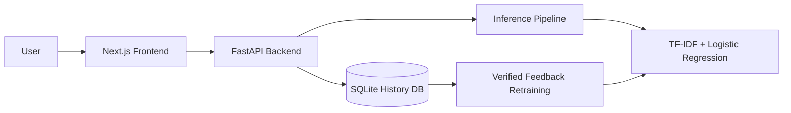

# Fake News Detector

A full-stack fake news classification project with a FastAPI backend, a Next.js frontend, SQLite-backed history, and a TF-IDF + Logistic Regression model.

The repository is organized for clean GitHub presentation: source code and documentation are committed, while large datasets, trained artifacts, downloaded NLP resources, logs, caches, and local runtime files stay out of version control.

## Current Project Status

- The web UI supports prediction, history, metrics, retrain status, manual retraining, and report download
- The backend and Next.js route handlers support verifying history entries, but the current main page does not expose a verification control yet
- The backend can run in demo mode even when no trained model artifact is present
- Training datasets belong in `backend/data/` and generated model outputs belong in `backend/models/`, but those files are intentionally not committed

## Features

- Predict from pasted article text
- Predict from article URLs using backend scraping
- Return `FAKE` or `REAL` with confidence and class probabilities
- Surface influential keywords for explainability
- Store prediction history in SQLite
- Expose history verification endpoints for collecting ground-truth labels
- Retrain the model from verified labels while keeping a fixed validation holdout
- Check retraining readiness and auto-check for retraining every 50 successful predictions by default
- Fall back to a demo heuristic mode if a trained model artifact is unavailable

## Tech Stack

- Frontend: Next.js 16, React 19, TypeScript, Tailwind CSS, shadcn/ui, Recharts, Framer Motion
- Backend: FastAPI, Pydantic, SQLite
- ML/NLP: scikit-learn, pandas, NLTK, BeautifulSoup, requests
- Tooling: PowerShell helper scripts, pytest, ESLint, TypeScript, GitHub Actions

## Architecture



See [docs/system-architecture.md](docs/system-architecture.md) for the current code-level architecture.

## Repository Structure

```text
.
|-- backend/
|   |-- README.md
|   |-- main.py
|   |-- inference.py
|   |-- preprocessing.py
|   |-- train.py
|   |-- model.py
|   |-- db.py
|   |-- data/
|   |-- models/
|   |-- tests/
|   |-- requirements.txt
|   `-- requirements-dev.txt
|-- frontend/
|   |-- src/app/
|   |-- src/components/
|   |-- src/lib/
|   |-- app/api/
|   |-- public/
|   |-- .env.local.example
|   `-- package.json
|-- docs/
|   |-- system-architecture.md
|   |-- flowchart.md
|   `-- complete_project_report.md
|-- scripts/
|   |-- setup.ps1
|   |-- dev.ps1
|   `-- check.ps1
|-- .github/workflows/ci.yml
`-- LICENSE
```

## Quick Start

### Option 1: Windows setup scripts

Install backend and frontend dependencies, create the backend virtual environment, and copy env files:

```powershell
powershell -ExecutionPolicy Bypass -File .\scripts\setup.ps1
```

Start the backend and frontend in separate PowerShell windows:

```powershell
powershell -ExecutionPolicy Bypass -File .\scripts\dev.ps1
```

Open `http://localhost:3000`.

### Option 2: Manual setup

#### Backend

```powershell
cd backend
python -m venv .venv
.\.venv\Scripts\activate
pip install -r requirements.txt
copy .env.example .env
python main.py
```

#### Frontend

```powershell
cd frontend
npm install
copy .env.local.example .env.local
npm run dev
```

Open `http://localhost:3000`.

## Environment Configuration

### Frontend

Use [frontend/.env.local.example](frontend/.env.local.example):

```env
BACKEND_URL=http://127.0.0.1:8000
```

`frontend/src/lib/backend.ts` also accepts `NEXT_PUBLIC_BACKEND_URL`, but `BACKEND_URL` is the value used by the example env file and CI build.

### Backend

Use [backend/.env.example](backend/.env.example):

```env
FAKE_NEWS_DB_FILENAME=fake_news_history.db
FAKE_NEWS_AUTO_RETRAIN_CHECK_INTERVAL=50
FAKE_NEWS_CORS_ORIGINS=http://localhost:3000,http://127.0.0.1:3000
```

## API Surface

Main FastAPI routes in `backend/main.py`:

- `GET /`
- `GET /health`
- `POST /predict`
- `POST /predict-url`
- `GET /metrics`
- `GET /history`
- `GET /history/stats`
- `POST /history/{entry_id}/verify`
- `GET /training/stats`
- `POST /retrain`
- `GET /retrain/status`

The repo also contains Next.js route handlers under `frontend/app/api/`, but the current main page mostly calls the FastAPI backend directly through `fetchBackend()`.

## Training, Retraining, and Artifacts

- Place the Kaggle dataset files `Fake.csv` and `True.csv` inside `backend/data/`
- Running training writes model files, metrics, and plots into `backend/models/`
- Optional NLTK downloads are stored locally under `backend/nltk_data/`
- These generated assets are ignored so the repository stays lightweight and review-friendly

### Prepare the dataset

Download the dataset from Kaggle:

- https://www.kaggle.com/clmentbisaillon/fake-and-real-news-dataset

Then place these files in `backend/data/`:

- `Fake.csv`
- `True.csv`

### Train the model

```powershell
cd backend
.\.venv\Scripts\activate
python train.py
```

### Regenerate evaluation plots

```powershell
cd backend
.\.venv\Scripts\activate
python generate_plots.py
```

### Retraining behavior

- Verified samples come from SQLite history entries with `verified_label`
- Retraining requires at least `50` verified samples after preprocessing
- Retraining combines verified samples with the saved base training split
- Evaluation runs on the fixed holdout saved in `backend/models/training_splits.joblib`
- Successful retraining replaces the in-memory model and writes updated metrics back to disk

## Quality Checks

### Backend tests

```powershell
cd backend
.\.venv\Scripts\activate
pytest tests --basetemp=.pytest-tmp -o cache_dir=.pytest-tmp/.pytest_cache
```

### Frontend checks

```powershell
cd frontend
npm run lint
npm run typecheck
npm run build
```

### Full local check

```powershell
powershell -ExecutionPolicy Bypass -File .\scripts\check.ps1
```

## Implementation Notes

- The production model is a TF-IDF vectorizer plus balanced Logistic Regression
- Training currently uses `max_features=10000`, `ngram_range=(1, 2)`, `min_df=2`, and `max_df=0.95`
- If the trained model cannot be loaded, inference falls back to a heuristic demo mode so the UI still works
- URL prediction uses `requests` plus BeautifulSoup-based article extraction in `backend/inference.py`
- Preprocessing uses local NLTK resources when available and falls back to sklearn stopwords or regex tokenization when optional NLTK resources are missing

## Limitations

- Fake-news detection is probabilistic and should be treated as decision support, not final truth
- URL scraping quality depends on site structure and may fail on heavily scripted pages
- The current web UI does not yet expose the verification endpoint, so verified labels must currently be created through the API layer
- Retraining runs in-process inside the API server, which is fine for local demos but not ideal for larger deployments

## Related Docs

- [docs/system-architecture.md](docs/system-architecture.md)
- [docs/flowchart.md](docs/flowchart.md)
- [docs/complete_project_report.md](docs/complete_project_report.md)

## License

This project is licensed under the MIT License. See [LICENSE](LICENSE).
