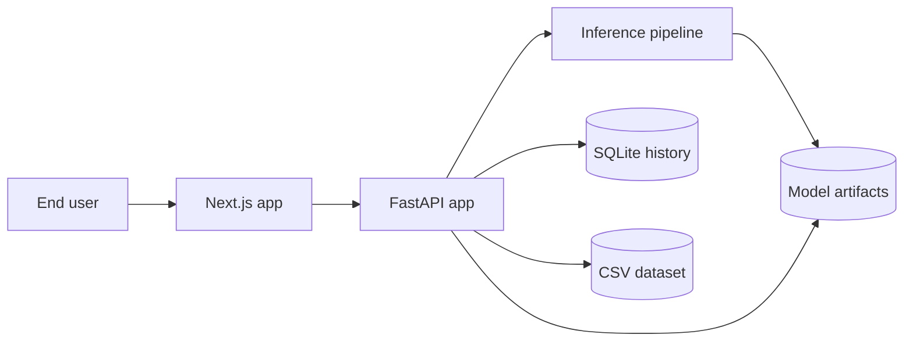

# Architecture

## Project Summary

- Project name: `Fake News Detector`
- Type: full-stack web application
- Frontend: Next.js 16, React 19, TypeScript, Tailwind CSS, shadcn/ui
- Backend: FastAPI, Pydantic, SQLite
- Model: TF-IDF plus Logistic Regression
- Input modes: pasted article text and article URL scraping
- Output: label, confidence, class probabilities, keyword explanation, metrics, history, retrain status

## What Is Implemented

The current repository includes:

- the web application in `frontend/`
- the FastAPI backend in `backend/`
- the base training dataset in `backend/data/Fake.csv` and `backend/data/True.csv`
- SQLite-backed history persistence
- offline training and verified-label retraining logic
- backend tests plus frontend lint, typecheck, and build steps

The trained model artifact is optional at runtime:

- if `backend/models/fake_news_model.joblib` exists, it is loaded
- if it does not exist or is invalid, the backend falls back to heuristic demo predictions

## System Architecture

At a high level, the project is a web-first full-stack ML application with:

1. a Next.js frontend for the user interface
2. a FastAPI backend for orchestration and API endpoints
3. a TF-IDF plus Logistic Regression pipeline for preprocessing, inference, and evaluation
4. SQLite plus on-disk artifacts for persistence

### Runtime Topology



### Codebase Mapping

```text
frontend/
  src/app/page.tsx                  -> current main web UI
  src/lib/backend.ts                -> backend URL resolution and fetch helper
  app/api/**/route.ts               -> optional Next.js proxy routes
  src/components/ui/*               -> reusable UI primitives

backend/
  main.py                           -> FastAPI entrypoint and endpoint orchestration
  db.py                             -> SQLite schema and query helpers
  inference.py                      -> prediction pipeline and URL scraping
  preprocessing.py                  -> text cleanup and normalization
  model.py                          -> TF-IDF + Logistic Regression wrapper
  train.py                          -> offline training and verified retraining
  data/                             -> dataset CSVs
  models/                           -> model artifact, metrics, plots, training split
  nltk_data/                        -> NLTK resources
  tests/                            -> unit tests
```

## Backend Responsibilities

### `backend/main.py`

The FastAPI app currently provides:

- `GET /`
- `GET /health`
- `POST /predict`
- `POST /predict-url`
- `GET /metrics`
- `GET /history`
- `GET /history/stats`
- `POST /history/{entry_id}/verify`
- `GET /training/stats`
- `POST /retrain`
- `GET /retrain/status`

It also:

- initializes SQLite on startup
- initializes the predictor path
- stores prediction history
- triggers periodic auto-retraining checks

### `backend/db.py`

The SQLite layer stores:

- text or URL source
- prediction label
- confidence and class probabilities
- keyword explanation payload
- processing time
- error details
- `verified_label` and `verified_at`
- creation timestamp

Retraining currently requires at least `50` verified samples after preprocessing.

### `backend/inference.py`

This module provides:

- lazy model and preprocessor loading
- text prediction
- URL scraping with `requests`
- article extraction with BeautifulSoup
- keyword importance output
- heuristic fallback predictions when no fitted model is available

### `backend/preprocessing.py`

The preprocessing pipeline performs:

- HTML, URL, email, mention, and hashtag cleanup
- lowercasing
- punctuation cleanup
- tokenization
- stopword removal
- optional lemmatization

It prefers bundled local NLTK resources and falls back gracefully when optional resources are missing.

### `backend/model.py`

The model wrapper encapsulates:

- `TfidfVectorizer`
- balanced `LogisticRegression`
- prediction and probability methods
- keyword importance extraction
- evaluation metrics
- save and load behavior

Current implemented configuration in code:

- `max_features=10000`
- `ngram_range=(1, 2)`
- `min_df=2`
- `max_df=0.95`
- `sublinear_tf=True`
- `strip_accents='unicode'`
- `solver='lbfgs'`
- `class_weight='balanced'`
- `max_iter=1000`
- `C=1.0`
- `random_state=42`

### `backend/train.py`

The training script:

- loads `Fake.csv`, `fake.csv`, `False.csv`, or `false.csv`
- loads `True.csv` or `true.csv`
- constructs `full_text` from title plus article body
- preprocesses the dataset
- builds a deterministic train/validation split
- trains and evaluates the model
- saves the model, metrics, and split bundle

Verified retraining reuses the saved base training split and evaluates on the same fixed validation holdout.

## Frontend Responsibilities

### `frontend/src/lib/backend.ts`

This module resolves the backend base URL from:

1. `BACKEND_URL`
2. `NEXT_PUBLIC_BACKEND_URL`
3. a default of `http://127.0.0.1:8000`

### `frontend/src/app/page.tsx`

The current page is the main UI surface. It currently supports:

- backend health checks
- prediction from text
- prediction from URL
- metrics and charts
- history browsing
- retrain status display
- manual retraining
- plain-text report download

Important limitation:

- the current page does not expose a verification control for history items

### `frontend/app/api/*`

The repo includes Next.js route handlers that proxy to FastAPI for:

- health
- history
- verification
- metrics
- prediction
- URL prediction
- retraining
- retrain status

These handlers exist, but the current page mostly calls the FastAPI backend directly via `fetchBackend()`.

## Runtime Flow

### Prediction Flow

```text
Frontend submits text or URL
-> FastAPI validates the request
-> URL input is scraped and converted to plain text if needed
-> TextPreprocessor normalizes the text
-> FakeNewsModel returns class probabilities when a fitted model exists
-> fallback heuristics run when no fitted model exists
-> keyword importance is attached when possible
-> history is stored in SQLite
-> result is returned to the UI
```

### Verification Flow

```text
Client calls POST /history/{entry_id}/verify
-> FastAPI validates the entry and label
-> verified label is saved in SQLite
-> entry becomes eligible for retraining
```

This flow is implemented in the backend and route handlers, but not yet exposed in the current web page.

### Retraining Flow

```text
Client calls POST /retrain
-> verified samples are loaded from SQLite
-> saved base split is loaded from training_splits.joblib
-> verified samples are appended to the base training set
-> model retrains
-> evaluation runs on the fixed holdout
-> model and metrics are saved
-> in-memory model is replaced
```

Auto-retraining is only checked periodically. By default, the check runs after every `50` successful predictions.

## Known Constraints

- fake-news detection is probabilistic and not authoritative
- scraping can fail on unsupported or heavily scripted sites
- verification exists at the API layer, but not yet in the current UI
- retraining runs in-process and is best suited for local demos or small deployments

## Conclusion

The current codebase is a complete web-based ML application rather than just a model script. It includes a real UI, a real API layer, persisted history, explainable predictions, and a retraining workflow with a fixed holdout strategy. The main functional gap between backend and frontend is that verification is implemented in the API, but not yet surfaced in the page UI.
