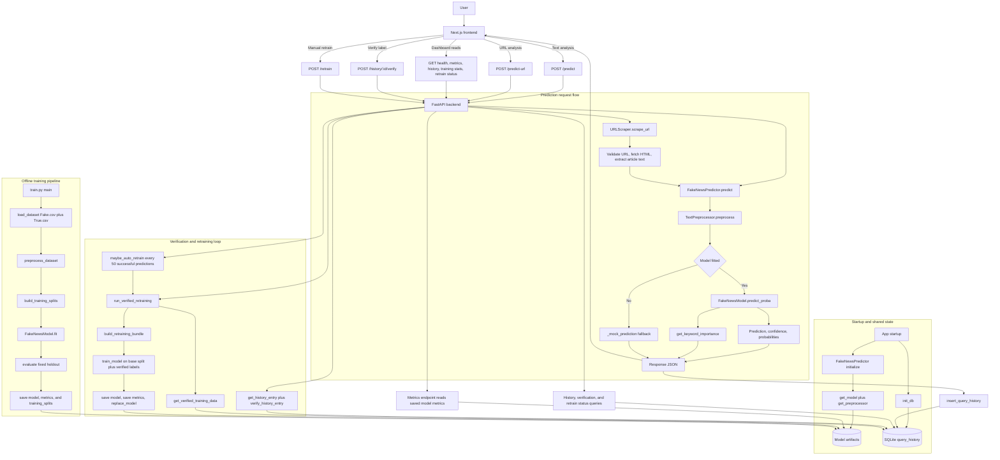
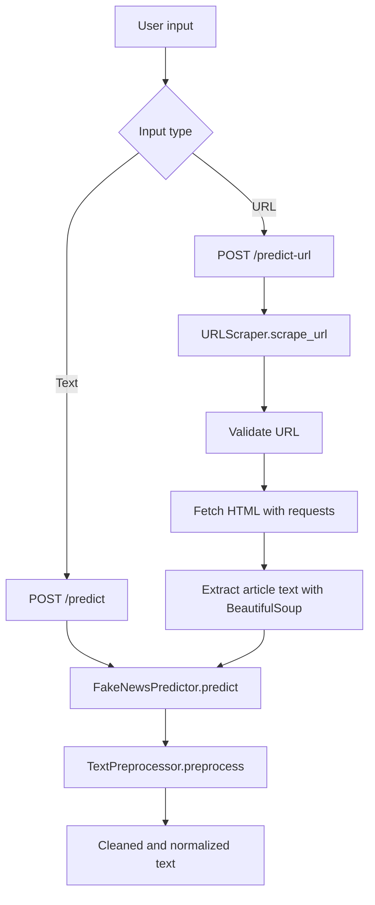
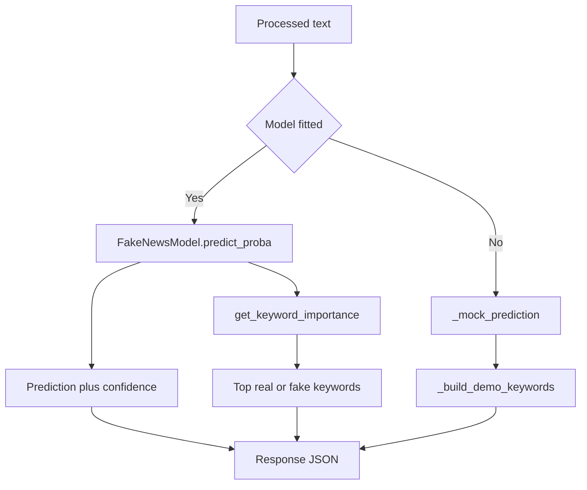
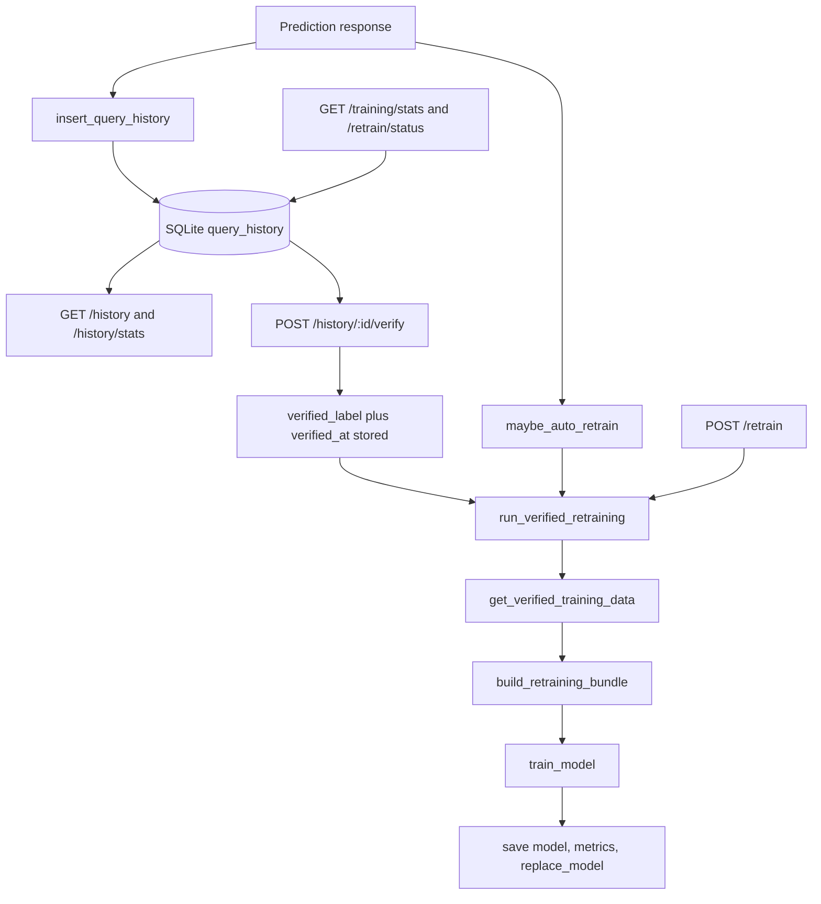
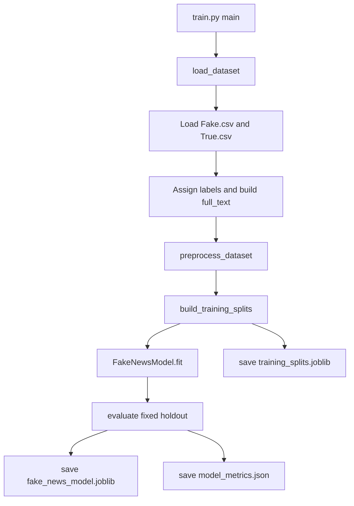

# Flowchart and Component Workflow

## Overall Flowchart (Mermaid)

Overall system view retained in `docs/diagram.mmd`.

## Preprocessing Flow

Focused preprocessing view retained in `docs/preprocessing_diagram.mmd`.

## Prediction Flow

Focused prediction view retained in `docs/prediction_diagram.mmd`.

## History and Retraining Flow

Focused storage and feedback loop retained in `docs/history_retraining_diagram.mmd`.

## Offline Training Flow

Focused training pipeline retained in `docs/training_pipeline_diagram.mmd`.

## Backend Algorithmic Workflow

1. `main.py` starts by initializing SQLite history storage and the shared predictor components.
2. the frontend calls FastAPI directly for health, metrics, history, prediction, verification, and retraining endpoints.
3. text requests go to `FakeNewsPredictor.predict()`, while URL requests first pass through `URLScraper.scrape_url()`.
4. extracted text is normalized by `TextPreprocessor.preprocess()`.
5. if a trained model exists, `FakeNewsModel.predict_proba()` and `get_keyword_importance()` build the final result.
6. if the model is unavailable, `_mock_prediction()` returns a fallback prediction and demo keywords.
7. each prediction is written to SQLite with probabilities, keywords, timing, and any error details.
8. successful predictions also trigger the periodic auto-retraining readiness check.

## Verification and Retraining Workflow

1. the frontend can verify a stored prediction with `POST /history/:id/verify`.
2. verified labels are stored in SQLite and become eligible retraining samples.
3. `/training/stats` and `/retrain/status` summarize current verified data and retraining readiness.
4. `/retrain` and automatic checks both call `run_verified_retraining()`.
5. retraining combines the fixed base training split with verified feedback, evaluates on the fixed holdout, then saves the new model and metrics.

## Data Science Flow

- Train with `train.py` using `Fake.csv` and `True.csv`
- Preprocess the full dataset before building a deterministic train and validation split
- Evaluate metrics on a fixed holdout: accuracy, precision, recall, F1, confusion matrix
- Save model pipeline to `backend/models/fake_news_model.joblib`
- Save metrics to `backend/models/model_metrics.json`
- Save reusable split metadata to `backend/models/training_splits.joblib`
