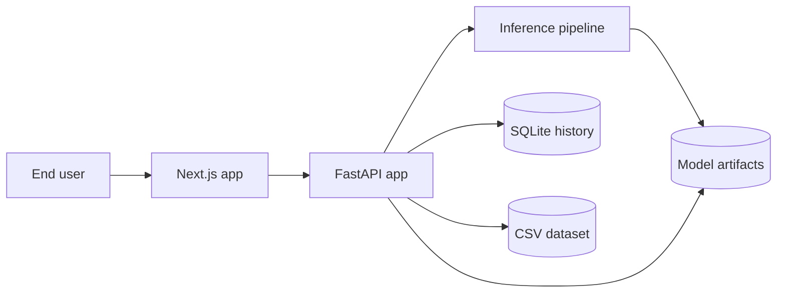

# System Architecture

This document describes the architecture that is currently implemented in the repository.

At a high level, the project is a web-first full-stack ML application with:

1. a Next.js frontend for the user interface
2. a FastAPI backend for orchestration and API endpoints
3. a TF-IDF plus Logistic Regression pipeline for preprocessing, inference, and evaluation
4. SQLite plus on-disk artifacts for persistence

## Runtime Topology



## Codebase Mapping

```text
frontend/
  src/app/page.tsx                  -> current main web UI
  src/lib/backend.ts                -> backend URL resolution and fetch helper
  app/api/**/route.ts               -> optional Next.js proxy routes
  src/components/ui/*               -> reusable UI primitives

backend/
  main.py                           -> FastAPI entrypoint and endpoint orchestration
  db.py                             -> SQLite schema and query helpers
  inference.py                      -> prediction pipeline and URL scraping
  preprocessing.py                  -> text cleanup and normalization
  model.py                          -> TF-IDF + Logistic Regression wrapper
  train.py                          -> offline training and verified retraining
  data/                             -> dataset CSVs
  models/                           -> model artifact, metrics, plots, training split
  nltk_data/                        -> local NLP resources when available

scripts/
  setup.ps1                         -> local bootstrap
  dev.ps1                           -> launches backend and frontend shells
  check.ps1                         -> local test/lint/build checks
```

## Frontend Layer

The current user-facing app lives in `frontend/src/app/page.tsx`.

What the current page does:

- checks backend health
- loads metrics and recent history
- submits text predictions
- submits URL predictions
- shows charts and summary metrics
- exposes retraining status and a manual retrain button
- lets the user download a plain-text analysis report

What the current page does not do yet:

- it does not expose a UI control for `POST /history/{entry_id}/verify`

That distinction matters because verification exists in the backend, database layer, and Next.js route handlers, but not in the main page UI.

## Web Integration Layer

The repository includes Next.js route handlers under `frontend/app/api/` for:

- `/api/health`
- `/api/history`
- `/api/history/[id]/verify`
- `/api/metrics`
- `/api/predict`
- `/api/predict-url`
- `/api/retrain`
- `/api/retrain-status`

These handlers proxy requests to FastAPI through `frontend/src/lib/backend.ts`.

Important current behavior:

- the main page mostly calls `fetchBackend()` directly
- the Next.js route handlers exist, but they are not the primary request path for the current UI

So the effective browser flow today is usually:

```text
Browser -> FastAPI
```

## FastAPI Application Layer

`backend/main.py` is the orchestration layer. It owns:

- app startup and shutdown
- CORS configuration
- Pydantic request and response models
- history persistence after predictions
- verified-label retraining flow
- periodic auto-retraining checks

### Current backend routes

- `GET /`
- `GET /health`
- `POST /predict`
- `POST /predict-url`
- `GET /metrics`
- `GET /history`
- `GET /history/stats`
- `POST /history/{entry_id}/verify`
- `GET /training/stats`
- `POST /retrain`
- `GET /retrain/status`

### Startup behavior

On startup, the backend:

1. initializes the SQLite schema with `init_db()`
2. creates the shared predictor path through `FakeNewsPredictor()`
3. tries to load a saved model artifact from `backend/models/fake_news_model.joblib`

If the model artifact is missing or invalid, prediction still works through the fallback heuristic mode in `backend/inference.py`.

## ML Pipeline Layer

The ML implementation is split across four modules.

### Preprocessing

`backend/preprocessing.py` handles:

- HTML, URL, email, mention, and hashtag cleanup
- lowercasing
- punctuation removal
- tokenization
- stopword removal
- optional lemmatization
- fallback behavior when optional NLTK resources are unavailable

The code prefers bundled local NLTK resources from `backend/nltk_data/`. If some resources are missing, it falls back to regex tokenization or sklearn's English stopword set where possible.

### Inference

`backend/inference.py` handles:

- lazy loading of the model and preprocessor
- model reload if a saved artifact appears after startup
- text prediction
- URL validation, fetch, and article extraction
- keyword importance extraction
- heuristic fallback predictions when the model is not fitted

### Model Wrapper

`backend/model.py` encapsulates:

- `TfidfVectorizer`
- balanced `LogisticRegression`
- prediction and probability scoring
- keyword importance extraction
- evaluation metrics
- save and load behavior

Current implemented defaults:

- `max_features=10000`
- `ngram_range=(1, 2)`
- `min_df=2`
- `max_df=0.95`
- `sublinear_tf=True`
- `strip_accents='unicode'`
- `class_weight='balanced'`
- `solver='lbfgs'`
- `max_iter=1000`
- `C=1.0`
- `random_state=42`

### Training and Verified Retraining

`backend/train.py` implements:

- dataset loading from `backend/data/Fake.csv`, `fake.csv`, `False.csv`, or `false.csv`
- positive-class loading from `backend/data/True.csv` or `true.csv`
- preprocessing of the full dataset
- deterministic train/validation split generation
- persistence of `training_splits.joblib`
- model training and evaluation
- retraining bundle creation from verified labels plus the saved base training split

Verified retraining in `backend/main.py` works like this:

1. load verified examples from SQLite
2. require at least `50` verified samples after preprocessing
3. append verified examples to the saved base training split
4. evaluate on the fixed validation holdout
5. save the new model and metrics
6. replace the in-memory model for future predictions

Auto-retraining is only checked periodically. By default, `maybe_auto_retrain()` runs the check after every `50` successful predictions, controlled by `FAKE_NEWS_AUTO_RETRAIN_CHECK_INTERVAL`.

## Persistence Layer

The application stores two kinds of state.

### Runtime State

`backend/db.py` manages a local SQLite database containing the `query_history` table.

Stored fields include:

- request source
- input text or URL
- prediction label
- confidence
- fake and real probabilities
- keywords
- processing time
- error text
- verified label
- verification timestamp
- created timestamp

This supports:

- recent history display
- usage statistics
- verified training data collection

### Model State

`backend/models/` stores:

- `fake_news_model.joblib`
- `model_metrics.json`
- `training_splits.joblib`
- generated evaluation plots

These are training outputs. The code supports both cases:

- a saved model exists and is loaded
- no saved model exists and inference falls back to heuristics

### Dataset State

`backend/data/` stores the base dataset CSVs used by offline training. The current repository includes those CSVs, so the training pipeline can run without a separate download step.

## Current Request Flows

### Text Prediction

```text
User enters text
-> frontend submits POST /predict
-> FastAPI validates the request
-> TextPreprocessor.preprocess() normalizes the text
-> FakeNewsModel.predict_proba() scores the text when a fitted model exists
-> fallback heuristic prediction runs if no fitted model is available
-> keyword importance is attached when possible
-> prediction is written to SQLite history
-> response is returned to the UI
```

### URL Prediction

```text
User submits a URL
-> frontend submits POST /predict-url
-> FastAPI validates that the URL starts with http:// or https://
-> URLScraper fetches HTML with requests
-> BeautifulSoup extracts readable article text
-> the extracted text goes through the same prediction pipeline
-> prediction and source text are written to SQLite history
```

### Verification

```text
Client calls POST /history/{entry_id}/verify
-> FastAPI checks that the history entry exists
-> FastAPI requires stored source text
-> verified_label and verified_at are written to SQLite
-> the entry becomes eligible for retraining
```

This flow is available at the API layer today, but the current `frontend/src/app/page.tsx` does not yet expose it.

### Retraining

```text
Client calls POST /retrain
-> FastAPI loads verified samples from SQLite
-> base training split is loaded from backend/models/training_splits.joblib
-> verified samples are preprocessed and appended to the base train split
-> model is retrained and evaluated on the fixed holdout
-> model and metrics are saved
-> cached in-memory model is replaced
```

## Documentation Map

Use these focused docs for each major part of the pipeline:

- [pipeline-overview.md](pipeline-overview.md)
- [frontend-backend-flow.md](frontend-backend-flow.md)
- [preprocessing-pipeline.md](preprocessing-pipeline.md)
- [inference-pipeline.md](inference-pipeline.md)
- [history-persistence-pipeline.md](history-persistence-pipeline.md)
- [training-retraining-pipeline.md](training-retraining-pipeline.md)
