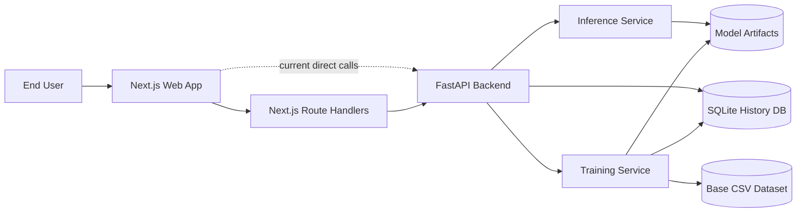
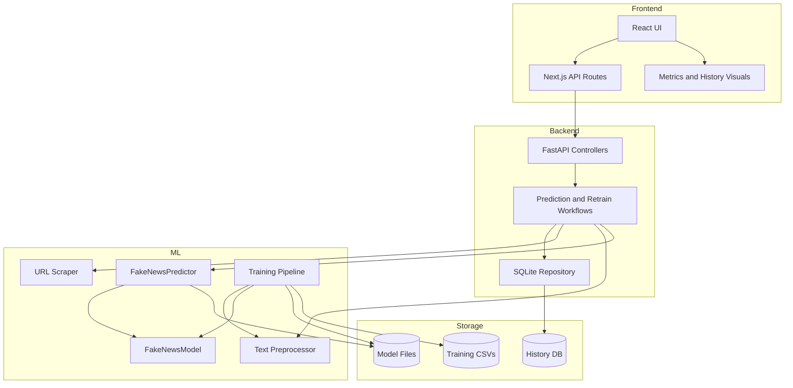
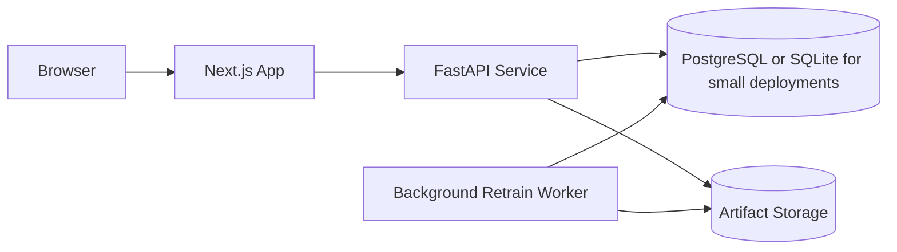

# System Architecture

This project is best understood as a full-stack ML product with five cooperating layers:

1. `Presentation layer` in Next.js for the user experience
2. `Web integration layer` in Next.js route handlers for backend proxying
3. `Application API layer` in FastAPI for orchestration and validation
4. `ML pipeline layer` for preprocessing, inference, explanation, and retraining
5. `Persistence layer` for SQLite history plus model artifacts on disk

The current repository already implements most of this shape. The architecture below documents the real system as it exists today, and also defines the recommended target structure for scaling the app cleanly.

## Architecture Goals

- Keep the app easy to demo locally
- Keep the ML pipeline interpretable and fast
- Preserve a clean separation between UI, API orchestration, and model logic
- Support a feedback loop through human verification and retraining
- Avoid infrastructure that is too heavy for a student or portfolio project

## Repository-to-Architecture Mapping

```text
frontend/
  src/app/page.tsx              -> UI shell and feature orchestration
  app/api/**/route.ts           -> Next.js API proxy/BFF layer
  src/lib/backend.ts            -> shared backend client
  src/components/ui/*           -> reusable UI primitives

backend/
  main.py                       -> FastAPI entrypoint and application services
  inference.py                  -> prediction and URL scraping pipeline
  preprocessing.py              -> text cleaning and token normalization
  model.py                      -> TF-IDF + Logistic Regression model wrapper
  train.py                      -> offline training and verified retraining flow
  db.py                         -> SQLite persistence and training-data queries
  models/*                      -> persisted model, metrics, plots, training split

docs/
  system-architecture.md        -> full architecture design
```

## System Context



## Logical Architecture

### 1. Presentation Layer

The presentation layer lives in Next.js and is responsible for:

- text and URL submission
- displaying prediction confidence and keyword explanations
- showing model metrics and backend health
- browsing history
- submitting verified labels
- initiating retraining

Current implementation notes:

- The main UI is concentrated in `frontend/src/app/page.tsx`
- Reusable primitives are already isolated under `frontend/src/components/ui`
- The page currently performs most feature orchestration client-side

Recommended target structure:

```text
frontend/src/
  app/
    page.tsx
  features/
    prediction/
    history/
    metrics/
    retraining/
    health/
  components/
    layout/
    charts/
    shared/
```

This keeps the page shell thin and moves business-specific UI logic into dedicated feature modules.

### 2. Web Integration Layer

The repo already contains a lightweight BFF-style layer in `frontend/app/api/**/route.ts` for:

- `/api/predict`
- `/api/predict-url`
- `/api/history`
- `/api/history/[id]/verify`
- `/api/metrics`
- `/api/health`
- `/api/retrain`
- `/api/retrain-status`

Responsibilities of this layer:

- hide the backend base URL from browser components
- normalize backend failures into UI-safe responses
- provide a stable contract for the frontend
- create a future place for auth, rate limiting, and caching

Important design note:

The current UI mostly calls `fetchBackend()` directly against FastAPI. For a cleaner production architecture, the browser should call the Next.js `/api/*` routes, and only the route handlers should call FastAPI.

Recommended browser path:

```text
Browser -> Next.js route handler -> FastAPI -> ML/Data services
```

### 3. Application API Layer

FastAPI in `backend/main.py` acts as the orchestration layer. It owns:

- request validation with Pydantic
- endpoint contracts
- application startup and dependency initialization
- history insertion
- verification workflow
- retraining triggers
- periodic auto-retraining checks

Core API surface:

- `POST /predict`
- `POST /predict-url`
- `GET /metrics`
- `GET /history`
- `GET /history/stats`
- `POST /history/{id}/verify`
- `GET /training/stats`
- `POST /retrain`
- `GET /retrain/status`
- `GET /health`

This layer should remain thin. It should coordinate workflows, not contain model details.

### 4. ML Pipeline Layer

The ML layer is split into four focused modules.

#### Preprocessing

`backend/preprocessing.py` handles:

- HTML and URL cleanup
- punctuation cleanup
- tokenization
- stopword removal
- optional lemmatization
- fallback behavior when NLTK assets are unavailable

#### Inference

`backend/inference.py` handles:

- lazy model and preprocessor initialization
- prediction on preprocessed text
- URL scraping and content extraction
- keyword importance extraction
- fallback demo predictions when no trained model is available

#### Model Wrapper

`backend/model.py` encapsulates:

- TF-IDF vectorizer
- Logistic Regression classifier
- probability scoring
- keyword importance lookup
- evaluation metrics
- model artifact loading and saving

#### Training and Retraining

`backend/train.py` handles:

- base dataset loading from CSV
- deterministic preprocessing
- fixed train/validation split generation
- metrics calculation
- retraining bundle creation from verified labels plus base split

This is a good architecture for the chosen model family because it keeps the pipeline explainable and deterministic.

### 5. Persistence Layer

The app persists two kinds of state.

#### Transactional State

SQLite stores prediction history in `query_history` with fields for:

- source
- original text or URL
- prediction
- confidence
- fake and real probabilities
- keywords
- processing time
- error
- verified label
- verification timestamp
- created timestamp

This supports:

- auditable prediction history
- metrics for recent usage
- verified training samples

#### ML State

The `backend/models/` directory stores:

- trained model artifact
- model metrics JSON
- deterministic training split bundle
- generated plots

This separation is important:

- SQLite tracks runtime user activity
- artifact files track the current model version and training outputs

## Component View



## End-to-End Runtime Flows

### Flow A: Predict from Text

```text
User enters article text
-> Next.js UI submits prediction request
-> FastAPI validates payload
-> TextPreprocessor cleans and normalizes text
-> FakeNewsModel returns probabilities
-> Inference layer extracts top keywords
-> API stores history in SQLite
-> API returns prediction payload
-> UI renders result, confidence, and explanation
```

### Flow B: Predict from URL

```text
User submits a URL
-> FastAPI validates URL
-> URL scraper downloads article HTML
-> scraper extracts readable article text
-> text enters the same preprocessing + prediction pipeline
-> API stores source text and result in SQLite
-> UI renders prediction and explanation
```

### Flow C: Verify Historical Prediction

```text
User selects a history item
-> user marks label as REAL or FAKE
-> FastAPI updates verified_label and verified_at in SQLite
-> verified entry becomes eligible for retraining
```

### Flow D: Retrain with Verified Feedback

```text
Verified entries are loaded from SQLite
-> base deterministic training split is loaded from disk
-> verified samples are preprocessed and appended to base training split
-> model retrains on combined training data
-> evaluation runs on the fixed validation holdout
-> new model and metrics are saved to backend/models/
-> in-memory model is replaced for future predictions
```

## Deployment Architecture

### Local Development

Best fit for the current repo:

```text
User Browser
  -> Next.js dev server on :3000
  -> FastAPI server on :8000
  -> SQLite file and model artifacts on local disk
```

Why it works well:

- simple to run in a classroom or demo setting
- minimal infrastructure
- fast enough for TF-IDF inference
- portable across developer machines

### Recommended Production Topology



Production recommendations:

- keep Next.js and FastAPI as separate deployable services
- move long retraining jobs off the request thread into a worker
- store artifacts in object storage if multiple backend instances are used
- replace SQLite with PostgreSQL when concurrent write load grows

## Data Contracts

### Prediction Request

```json
{
  "text": "Article text...",
  "return_keywords": true,
  "top_keywords": 10
}
```

### Prediction Response

```json
{
  "success": true,
  "prediction": "REAL",
  "confidence": 92.5,
  "fake_probability": 7.5,
  "real_probability": 92.5,
  "keywords": [
    { "word": "official", "importance": 0.84, "type": "real" }
  ],
  "processing_time": 0.063,
  "timestamp": "2026-03-25T01:00:00"
}
```

### Verification Request

```json
{
  "verified_label": "FAKE"
}
```

## Cross-Cutting Concerns

### Error Handling

Current strengths:

- request validation at the API boundary
- fallback inference mode when no trained model exists
- persisted error records in history for failed requests

Recommended improvements:

- standardize error response envelopes across all routes
- add retry-safe handling around URL fetch timeouts
- return correlation IDs for debugging

### Security

For the current project scope, the main concerns are input safety and outbound URL fetching.

Recommended controls:

- restrict allowed URL schemes to `http` and `https`
- enforce request size limits
- add SSRF protections for URL scraping
- sanitize logs to avoid leaking raw article content unnecessarily
- add rate limits if the app becomes public

### Observability

Recommended minimal observability stack:

- structured request logs
- prediction latency measurement
- retraining start and finish events
- model version in `/health` and `/metrics`
- error counters for scraping and preprocessing failures

### Testing

The repo already includes backend tests. The full architecture should support:

- unit tests for preprocessing and model wrappers
- API tests for prediction, history, and verification endpoints
- integration tests for retraining flow
- frontend component tests for result rendering and failure states
- smoke tests for Next.js proxy routes

## Architectural Decisions

### Why TF-IDF + Logistic Regression

This is the right model architecture for this project because it is:

- fast to train
- fast to serve
- easy to explain
- simple to retrain with verified examples
- strong enough for a portfolio-quality end-to-end product

### Why SQLite

SQLite is a good fit because:

- the app is single-project and demo-friendly
- setup is trivial
- history volume is modest
- the retraining loop does not require distributed transactions

### Why a Fixed Holdout for Retraining

The training design intentionally keeps evaluation conservative:

- verified user labels are added only to the training side
- validation data stays stable
- retraining metrics remain comparable over time

That is a better story than continually re-splitting the dataset after each feedback cycle.

## Recommended Target Refactor Plan

If we continue evolving this app, the cleanest next architecture would be:

1. Browser calls only `frontend/app/api/*`
2. `frontend/src/app/page.tsx` is split into feature modules
3. FastAPI endpoints delegate to service functions instead of containing workflow logic inline
4. retraining moves into an async job or worker
5. model artifacts get explicit version metadata

Suggested backend structure:

```text
backend/
  api/
    routes/
  services/
    prediction_service.py
    history_service.py
    retraining_service.py
  repositories/
    history_repository.py
  ml/
    preprocessing.py
    inference.py
    model.py
    train.py
```

This keeps the app maintainable without changing its core stack.

## Final Architecture Summary

The full app architecture is:

- `Next.js UI` for interaction and visualization
- `Next.js API routes` as the web-facing integration layer
- `FastAPI` as the application orchestration layer
- `Preprocessing + TF-IDF + Logistic Regression` as the ML core
- `SQLite + model artifacts` as the persistence boundary
- `Verified-label retraining` as the feedback loop that turns the demo into a product system

That combination gives this project a strong balance of demo simplicity, explainability, and realistic software architecture.
